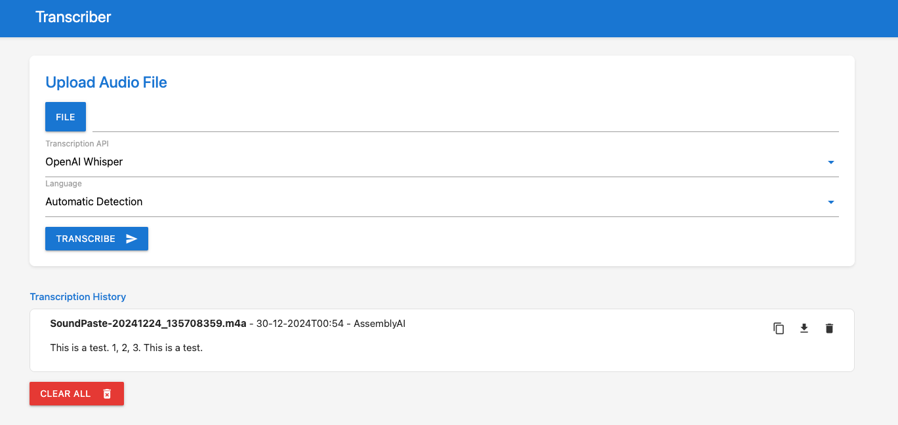

# Audio Transcriber

Audio Transcriber is an audio transcription application with a user-friendly web interface. It allows you to upload audio files and get transcriptions using one of three supported APIs:

- **AssemblyAI**  
- **OpenAI Whisper**  
- **OpenAI GPT 4o Transcribe** (new default)

The application automatically handles large files by splitting them into manageable chunks.

## Features

- **User-Friendly Web Interface:** A clean HTML/CSS/JavaScript frontend allows you to upload an audio file, select an API and choose a language.
- **Multiple Transcription APIs:** Choose from AssemblyAI, OpenAI Whisper, or the new OpenAI GPT 4o Transcribe.
- **Language Selection:** Choose your audio’s language manually or use the automatic language detection for convenience.
- **Transcription History:** View, copy, download or delete previously transcribed audio.
- **Large File Handling:** Audio files larger than 25MB are automatically split into chunks to overcome API limits.
- **Docker Deployment:** Simple deployment using Docker Compose or directly via Docker Hub.



## Usage

1. **Upload Audio File:** Click the "File" button to select an audio file from your computer.
2. **Select API:** Choose either AssemblyAI or OpenAI Whisper from the dropdown menu.
3. **Select Language:** Choose the language of your audio or select "Automatic Detection."
4. **Transcribe:** Click the "Transcribe" button to start the transcription.
5. **View History:** Your transcriptions will appear in the "Transcription History" section, where you can copy, download, or delete them.

## Prerequisites

- **API Keys:**  
  You must have valid API keys for AssemblyAI and/or OpenAI. Sign up at their respective websites to obtain them.
- **Docker:**  
  Ensure Docker is installed and running on your machine.
- **Python 3.9+ (if developing locally):**  
  Recommended for local testing and development.

## Environment Variables

The application relies on several environment variables. You can specify these in your `.env` file or directly in your Docker Compose file.

| Variable                   | Description                                                                                           | Accepted Values                         | Default             |
| -------------------------- | ----------------------------------------------------------------------------------------------------- | --------------------------------------- | ------------------- |
| `TZ`                       | The timezone for the application.                                                                     | Any valid timezone string               | `UTC`               |
| `ASSEMBLYAI_API_KEY`       | Your API key for AssemblyAI.                                                                          | Your AssemblyAI API key                 | *None (required)*   |
| `OPENAI_API_KEY`           | Your API key for OpenAI (used for both Whisper and GPT 4o Transcribe).                                | Your OpenAI API key                     | *None (required)*   |
| `DEFAULT_TRANSCRIBE_API`   | The default transcription API used when the application loads. Options: `assemblyai`, `openai`, `gpt4o`| `assemblyai`, `openai`, or `gpt4o`        | `gpt4o`             |
| `DEFAULT_LANGUAGE`         | The default language for transcription on startup.                                                  | `auto`, `en`, `nl`, `fr`, `es`            | `auto`              |

## Installation and Deployment

You have two primary options for installation and deployment:

### Option 1: Using Docker Hub (Recommended)

This is the fastest way to get started.

1. **Pull the Docker Image:**

   ```bash
   docker pull arnoulddw/transcriber-app:latest
   ```

2. **Run the Docker Container:**

   ```bash
   docker run -d -p 5001:5001 \
     -e TZ="Your/Timezone" \
     -e ASSEMBLYAI_API_KEY="your_assemblyai_api_key" \
     -e OPENAI_API_KEY="your_openai_api_key" \
     -e DEFAULT_TRANSCRIBE_API="gpt4o" \
     -e DEFAULT_LANGUAGE="auto" \
     --name transcriber-app \
     arnoulddw/transcriber-app:latest
   ```

   Replace `"Your/Timezone"`, `"your_assemblyai_api_key"`, and `"your_openai_api_key"` with your actual values.

### Option 2: Using Docker Compose

For further customization or local development, use Docker Compose.

1. **Clone the Repository:**

   ```bash
   git clone https://github.com/arnoulddw/transcriber
   cd transcriber
   ```

2. **Configure Environment Variables in docker-compose.yml**

   Update the `docker-compose.yml` file with your API keys and other environment variables under the `environment` section. An example configuration:

   ```yaml
   services:
     transcriber:
       build:
         context: .
         dockerfile: Dockerfile
       ports:
         - "5001:5001"
       volumes:
         - ./backend:/app/backend
         - ./temp_uploads:/app/temp_uploads
       environment:
         - TZ=${TZ:-UTC}
         - ASSEMBLYAI_API_KEY=your_assemblyai_api_key
         - OPENAI_API_KEY=your_openai_api_key
         - DEFAULT_TRANSCRIBE_API=${DEFAULT_TRANSCRIBE_API:-gpt4o}
         - DEFAULT_LANGUAGE=${DEFAULT_LANGUAGE:-auto}
       restart: unless-stopped
   ```

3. **Build and Run:**

   From the project’s root directory, run:

   ```bash
   docker-compose up -d --build
   ```

4. **Access the Application:**

   Open your browser and navigate to [http://localhost:5001](http://localhost:5001)

### Option 3: Local Development (Without Docker)

1. **Set up a Virtual Environment:**

   ```bash
   python3 -m venv venv
   ```

2. **Activate the Virtual Environment:**

   - On macOS/Linux:
     ```bash
     source venv/bin/activate
     ```
   - On Windows:
     ```bash
     venv\Scripts\activate
     ```

3. **Install Dependencies:**

   ```bash
   pip install -r backend/requirements.txt
   ```

4. **Configure Environment Variables:**

   Create a `.env` file with your API keys and preferences:

   ```env
   ASSEMBLYAI_API_KEY=your_assemblyai_api_key
   OPENAI_API_KEY=your_openai_api_key
   DEFAULT_TRANSCRIBE_API=gpt4o
   DEFAULT_LANGUAGE=auto
   TZ=Your/Timezone
   ```

5. **Run the Application:**

   ```bash
   python backend/app.py
   ```

6. **Access the Application:**

   Open [http://localhost:5001](http://localhost:5001) in your browser.

## Troubleshooting

- **Port 5001 is in use:** If this port is occupied, update the port mapping in the `docker-compose.yml` file or your Docker run command.
- **API Key Issues:** Ensure your API keys are entered correctly and that your AssemblyAI and OpenAI accounts are active.
- **File Upload Issues:** Verify that your audio file is in a supported format (mp3, mpga, m4a, wav, or webm).
- **Docker Errors:** Confirm Docker is running properly and that you have the necessary permissions.

## License

This project is licensed under the MIT License. See the LICENSE file for details.