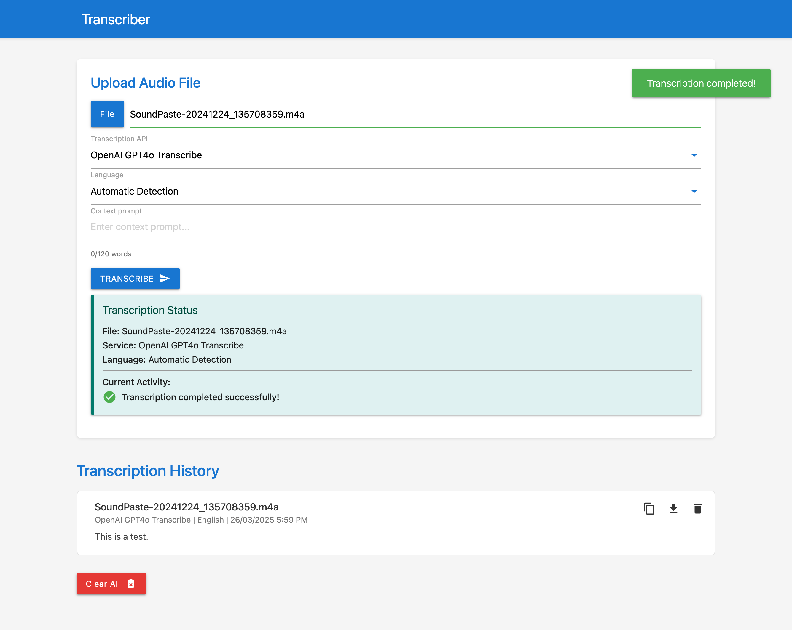

<!-- README.md -->

# Transcriber

## About This fork
This fork of the [arnoulddw/transcriber](https://github.com/arnoulddw/transcriber) focuses on the speed and accuracy of transcribing large audio and video files, such as lecture recordings, business meetings, conference presentations, etc. To take advantage of it, API accounts with a Usage Tier higher than Tier 1 are required. If you're just starting to use the OpenAI API and Gemini API or your audio recordings are short, the original repository is the best choice. Key differences of this fork:
- **Parallel transcription of several audio file segments** Several times faster than sequential processing for long records.
- **Segmentation of files on pauses in speech** Improves overall transcription quality.
- **Google Gemini /Vertex AI API option** Can be a good option for noisy recordings.
- **Configuration support reverse proxy** Can be installed as a personal transcription service on your personal domain behind the nginx with https and a secret access link.

| Source                 | Format | Size  | API       | Original transcriber   | Parallel processing (x10max) | Difference |
| ---------------------- | ------ | ----- | --------- | ---------------------- | ---------------------------- | ---------- |
| 02:05:06 meeting       |  m4a   | 61 MB | OpenAI 4o |     08 min 22 sec      |       01 min 25 sec          |    x5.9    |
| 01:08:22 earnings call |  webm  | 37 MB | OpenAI 4o |     04 min 35 sec      |       00 min 55 sec          |    x5      |
| 00:50:50 earnings call |  mp3   | 70 MB | OpenAI 4o |     04 min 56 sec      |       00 min 52 sec          |    x5.6    |
| 01:06:35 lecture       |  m4a   | 62 MB | OpenAI 4o |     04 min 55 sec      |       00 min 56 sec          |    x5.2    |
| 01:26:30 lecture       |  m4a   | 79 MB | OpenAI 4o |     05 min 55 sec      |       00 min 48 sec          |    x7.3    |


## About Transcriber
Transcriber is an audio and video transcription application with a user-friendly web interface. It allows you to upload audio or video files and get transcriptions using one of three supported APIs:

- **OpenAI GPT4o Transcribe** (new default)
- **Google Gemini 2.5 Pro**
- **OpenAI Whisper**
- **AssemblyAI**

The application automatically extracts audio from video files (using ffmpeg) and handles large files by splitting them into manageable chunks.

## Features

- **User-Friendly Web Interface:** A clean HTML/CSS/JavaScript frontend allows you to upload audio or video files, select an API and choose a language.
- **Video File Support:** Automatically extracts audio from video files (MP4, MOV, AVI, MKV, FLV, WMV, WebM) using ffmpeg before transcription.
- **Multiple Transcription APIs:** Choose from AssemblyAI, OpenAI Whisper or the new OpenAI GPT 4o Transcribe.
- **Language Selection:** Choose your audio's language manually or use the automatic language detection for convenience.
- **Context Prompting:** Add context hints for OpenAI APIs to improve transcription of specialized terms (limited to 120 words).
- **Transcription History:** View, copy, download or delete previously transcribed audio.
- **Large File Handling:** Audio files larger than 10MB are automatically split into chunks on pauses in speech to overcome API limits.
- **Parallel File Processing**
- **Docker Deployment:** Simple deployment using Docker Compose or directly via Docker Hub.



## Usage

1. **Upload Audio/Video File:** Click the "File" button to select an audio or video file from your computer. Supported formats:
   - Audio: MP3, M4A, WAV, OGG, WebM
   - Video: MP4, MOV, AVI, MKV, FLV, WMV, WebM
2. **Select API:** Choose either OpenAI 4o transcribe, Google Geminim, AssemblyAI or OpenAI Whisper from the dropdown menu.
3. **Select Language:** Choose the language of your audio or select "Automatic Detection."
4. **Add Context (Optional):** For OpenAI APIs, enter a context prompt to improve transcription accuracy (limited to 120 words).
5. **Transcribe:** Click the "Transcribe" button to start the transcription. Video files will have their audio extracted automatically before transcription.
6. **View History:** Your transcriptions will appear in the "Transcription History" section, where you can copy, download or delete them.

## Prerequisites
- **API Keys:**  
  You must have valid API keys for OpenAI and/or Gemini/Vertex and/or AssemblyAI. Sign up at their respective websites to obtain them.
- **Docker:**  
  Ensure Docker is installed and running on your machine.
- **Python 3.9-3.12 (if developing locally):**  
  !!! Python 3.13+ is not supported now.
  Recommended for local testing and development.

## Environment Variables

The application relies on several environment variables. You can specify these in your `.env` file or directly in your Docker Compose file.

| Variable                 | Description                                                                                           | Accepted Values                         | Default   |
| ------------------------ | ----------------------------------------------------------------------------------------------------- | --------------------------------------- | --------- |
| `TZ`                     | The timezone for the application.                                                                     | Any valid timezone string               | `UTC`     |
| `ASSEMBLYAI_API_KEY`     | Your API key for AssemblyAI.                                                                          | Your AssemblyAI API key                 | (none)    |
| `OPENAI_API_KEY`         | Your API key for OpenAI (used for both Whisper and GPT 4o Transcribe).                                | Your OpenAI API key                     | (none)    |
| `GEMINI_API_KEY`         | Your API key for Google Gemini (used for both Gemini API and Vertex AI).                              | Your Gemini/Vertex AI API key           | (none)    |
| `GEMINI_PROVIDER`        | Gemini provider 'google' for Gemini API, or 'vertex' for Vertex AI.                                   | `google`, `vertex`                      | `google`  |
| `VERTEXAI_PROJECT_ID`    | Your Google Cloud project id with Vertex AI API enabled.                                              | Your OpenAI API key                     | (none)    |
| `VERTEXAI_LOCATION`      | Your Google Cloud project location (used for both Gemini and Vertex AI).                              | See supported location on GC        | `us-central1` |
| `GEMINI_MODEL_NAME`      | Google Gemini model (used for both Gemini and Vertex AI).                                    | See supported models on Google/GCP          |`gemini-2.5-pro`|
| `OPENAI_MAX_CONCURRENCY` | Maximum allowed parallel threads accessing OpenAI API (for long files processing).                    | 1+                                      |   `4`     |
| `GEMINI_MAX_CONCURRENCY` | Maximum allowed parallel threads accessing Gemini/Vertex AI API (for long files processing).          | 1+                                      |   `4`     |
| `DEFAULT_TRANSCRIBE_API` | The default transcription API used when the application loads.                              | `gpt4o`, `gemini`, `assemblyai` or `whisper`      | `gpt4o`   |
| `DEFAULT_LANGUAGE`       | The default language for transcription on startup.                                                    | `auto`, `en`, `nl`, `fr`, `es`,`ru`     |  `auto`   |

[1]. [Gemini API in Vertex AI quickstart](https://cloud.google.com/vertex-ai/generative-ai/docs/start/quickstart?usertype=apikey)
[2]. [Generative AI on Vertex AI. Deployments and endpoints](https://cloud.google.com/vertex-ai/generative-ai/docs/learn/locations#available-regions)


## Installation and Deployment

You have two primary options for installation and deployment:

### Option 1: Using Docker Hub (Recommended)

This is the fastest way to get started.

1. **Pull the Docker Image:**

   ```bash
   docker pull ykharlamov/transcriber-app:latest
   ```

2. **Run the Docker Container:**

   ```bash
   docker run -d -p 5001:5001 \
     -e TZ="Your/Timezone" \
     -e ASSEMBLYAI_API_KEY="your_assemblyai_api_key" \
     -e OPENAI_API_KEY="your_openai_api_key" \
     -e GEMINI_API_KEY="your_gemini_api_key" \
     -e DEFAULT_TRANSCRIBE_API="gpt4o" \
     -e OPENAI_MAX_CONCURRENCY=8 \
     -e GEMINI_MAX_CONCURRENCY=8 \
     -e DEFAULT_LANGUAGE="auto" \
     --name transcriber-app \
     ykharlamov/transcriber-app:latest
   ```

   Replace `"Your/Timezone"`, `"your_openai_api_key"`, `"your_gemini_api_key"` and  `"your_assemblyai_api_key"` with your actual values.
   Set `"OPENAI_MAX_CONCURRENCY"` and `"OGEMINI_MAX_CONCURRENCY"` according to your API Usage Tiers, setting 8-10 parallel threads for OpenAI recommended for Usage Tier 3+ accounts, and your hardware must have enough resourses to process it. 
   Start small, with 3-4 threads, and try to increase later. Increasing the number of threads beyond your account's API Tier limits will result in retries. This will increase the overall processing time, not decrease it, and may increase API costs too.


### Option 2: Using Docker Compose

For further customization or local development, use Docker Compose.

1. **Clone the Repository:**

   ```bash
   git clone https://github.com/jur7/transcriber
   cd transcriber
   ```

2. **Configure Environment Variables in docker-compose.yml**

   Update the `docker-compose.yml` file with your API keys and other environment variables under the `environment` section. An example configuration:

   ```yaml
   services:
     transcriber:
       build:
         context: .
         dockerfile: Dockerfile
       ports:
         - "5001:5001"
       volumes:
         - ./backend:/app/backend
         - ./temp_uploads:/app/temp_uploads
       environment:
         - TZ=${TZ:-UTC}
         - ASSEMBLYAI_API_KEY=your_assemblyai_api_key
         - OPENAI_API_KEY=your_openai_api_key
         - DEFAULT_TRANSCRIBE_API=${DEFAULT_TRANSCRIBE_API:gpt4o}
         - DEFAULT_LANGUAGE=${DEFAULT_LANGUAGE:auto}
       restart: unless-stopped
   ```

3. **Build and Run:**

   From the project’s root directory, run:

   ```bash
   docker-compose up -d --build
   ```

4. **Access the Application:**

   Open your browser and navigate to [http://localhost:5001](http://localhost:5001)

### Option 3: Local Development (Without Docker)

1. **Set up a Virtual Environment:**

   On Mac/Linux (most cases)
   ```bash
   python3 -m venv venv
   ```

   On Windows (most cases)
   ```bash
   python -m venv venv
   ```

2. **Activate the Virtual Environment:**

   - On macOS/Linux:
     ```bash
     source venv/bin/activate
     ```
   - On Windows:
     ```bash
     venv\Scripts\activate
     ```

3. **Install Dependencies:**

   ```bash
   pip install -r requirements.txt
   ```

4. **Configure Environment Variables:**

   Create a `.env` file with your API keys and preferences:

   ```env
   ASSEMBLYAI_API_KEY=your_assemblyai_api_key
   OPENAI_API_KEY=your_openai_api_key
   GEMINI_API_KEY=your_gemini_api_key
   GEMINI_PROVIDER=google  # 'google' for Gemini API, or 'vertex' for Vertex AI
   VERTEXAI_PROJECT_ID=your_gcp_project_id
   VERTEXAI_LOCATION=us-central1
   GEMINI_MODEL_NAME=gemini-2.5-pro
   OPENAI_MAX_CONCURRENCY=8
   GEMINI_MAX_CONCURRENCY=8
   DEFAULT_TRANSCRIBE_API=gpt4o
   TZ=Your/Timezone
   ```

5. **Run the Application:**

   #### Option A. Start from console.
   ```bash
   python -m flask --app app run --port 5001
   ```
   #### Option B. Start from console in debug mode.
   ```bash
   python -m flask --app app run --port 5001 --debug
   ```
   #### Option C. Debug in Visual Studio Code
   1. Create .vscode folder
   2. Place launch.json and settings.json into .vscode folder
   3. Set your API keys in the launch.json file (if not presented as env variables) or delete these lines (if present)
   4. Install in VS Code Python extension.
   5. Open the folder in VS Code, press F5 to start debugging.


6. **Access the Application:**

   Open [http://localhost:5001](http://localhost:5001) in your browser.

## Troubleshooting

- **Port 5001 is in use:** If this port is occupied, update the port mapping in the `docker-compose.yml` file or your Docker run command.
- **API Key Issues:** Ensure your API keys are entered correctly and that your AssemblyAI and OpenAI accounts are active.
- **File Upload Issues:** Verify that your audio file is in a supported format (mp3, mpga, m4a, wav, or webm).
- **Docker Errors:** Confirm Docker is running properly and that you have the necessary permissions.

## License

This project is licensed under the MIT License.